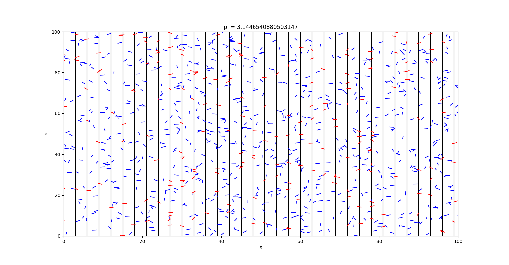

Repository dedicated to [Monte Carlo](https://en.wikipedia.org/wiki/Monte_Carlo_method) methods.
***
**Monte Carlo methods**, or ***Monte Carlo experiments***, are a broad class of computational algorithms that rely on repeated random sampling to obtain numerical results. The underlying concept is to use randomness to solve problems that might be deterministic in principle. They are often used in physical and mathematical problems and are most useful when it is difficult or impossible to use other approaches. Monte Carlo methods are mainly used in three problem classes: optimization, numerical integration, and generating draws from a probability distribution.
***
Two implementations to estimate the Pi value: 
---
Buffon

---
Geometrical

